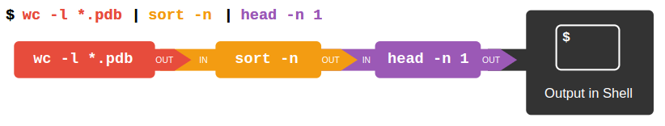

# Bash | Command Line Interface (CLI) command in the learning process

## General Codes

### Basic info and commands

* "*" is joker character zero or more character
* "?" is joker character only 1 character
* Control key may be described in many ways, including Ctrl-X, Control-X, and ^X.
* The shell does not have a trash bin: once something is deleted.
* Ctrl + c kills the running code
* Ctrl + a move to the beginning of a line
* Ctrl + e move to the end of a line 

```^[[200~
whoami (Return username)
pwd (print working directory)
clear (delete everything on screen)
```


### ls commands
```
ls (list files )
ls -F (add file and directory names)
  / indicates directory
  @ indicates link
  * indicates executable
ls -h (human readable)
ls -l (long listing format)
ls -t (time last changed)
ls -r (reverse list)
ls -a (show all, including hidden files)
ls Desktop (list a subdirectory if it exist)
ls --help (We can pass a --help option to any command)
man ls (We can read its manual with man)
```

### cd commands (Change directory)

```
cd (go to home directory)
cd .. (go to one level up)
cd - (go to previous directory)

cd Desktop
cd Desktop/shell-lesson-data

cd ~/Desktop/shell-lesson-data (~ means /home/ftekkartal)
cd /home/ftekkartal/Desktop/shell-lesson-data (absolute path)
cd ../../north-pacific-gyre/ (relative path: 2 times up, 1 step down(pwd=shell-lesson-data/exercise-data/alkanes))
```

### Tab completion;
```
  cd ~/Desktop/shell-lesson-data
  "ls nor" + press tab => "ls north-pacific-gyre/"
  double tab => list all items in that directory
  "ls north-pacific-gyre/g" + press tab => "ls north-pacific-gyre/goo"
  double tab => list all item begins with goo
```

### Create and delete files and directories;
* mkdir [path] creates a new directory.
* mkdir -p [path]  creates any intermediate subdirectories as required.
* rm [path] removes (deletes) a file.
* rm -r [path] removes (deletes) a directory.

```
pwd => /home/ftekkartal/Desktop/shell-lesson-data/exercise-data/writing
  mkdir thesis (crete a new directory named "thesis" in this directory ~/Desktop/shell-lesson-data/exercise-data/writing)
  mkdir -p ../project/furkan ../project/tekkartal (crete 2 new directories named "furkan" and "tekkartal' in this directory ~/Desktop/shell-lesson-data/exercise-data/project)

  ls -R ../project (List all nested subdirectories)

cd thesis
nano draft.txt (create a new text file)
touch my_file.txt (generate a blank text file)


rm my_file.txt (remove the file without asking)
rm -i my_file.txt (remove the file with asking)
rm -r -i thesis (remove the directory)

```

### Move and copy;

* mv [old] [new] moves (renames) a file or directory.
* cp [old] [new] copies a file.

```
mv thesis/draft.txt thesis/quotes.txt (The first argument tells mv what we’re ‘moving’, while the second is where it’s to go)

pwd => ~/Desktop/shell-lesson-data/exercise-data/writing
mv thesis/quotes.txt . (move file from /exercise-data/writing/thesis to /exercise-data/writing)

An example of moving;
  pwd => ~/Desktop/shell-lesson-data/exercise-data/writing
  ls -a furkan     => . .. a.txt b.txt
  ls -a tekkartal  => . ..

  cd furkan
  mv a.txt b.txt ../tekkartal

  cd ../
  ls -a furkan     => . .. 
  ls -a tekkartal  => . .. a.txt b.txt


An example of copying;
  pwd => ~/Desktop/shell-lesson-data/exercise-data/writing
  ls -a furkan     => . .. 
  ls -a tekkartal  => . .. a.txt b.txt

  cd tekkartal
  cp a.txt ../furkan

  cd ../
  ls -a furkan     => . .. a.txt
  ls -a tekkartal  => . .. a.txt b.txt

pwd => ~/Desktop/shell-lesson-data/exercise-data/writing
cp quotes.txt thesis/quotations.txt (copy a single file)
cp -r thesis thesis_backup (copy all content)

* cp needs directory name as the last argument.
```
### Word countd 

* wc counts lines, words, and characters in its inputs.

```
wc *.txt (word count | 4 column = line + character + words + file name)
wc -l *txt (line number + file name)
wc -m *txt (character number + file name)
wc -w *txt (word number + file name)
```

### Other commands (cat + less + sort + head + tail + echo + cut)

* This codes are not change the file, just affect on the screen
* cat displays the contents of its inputs.
* sort sorts its inputs.
* head displays the first 10 lines of its input.
* tail displays the last 10 lines of its input.

```
cat lengths.txt (concatenate(join together) files and show on screen)
```
```
less lengths.txt  (same as cat bur list only a screenful of the file (like first page))
    (Space -> next page)
    (b -> back pace)
    (q -> quit) 
```
```
sort number.txt (sort alphanumerical)
sort -n number.txt (sort numerical)
```
```
head -n 1 number.txt (take 1 line from top)
```
```
tail -n 1 number.txt (take 1 line from bottom)
```
```
echo The echo command prints text
```

```
cut -d , -f 2 animals.csv | sort | uniq -c

  * cut  means remove or ‘cut out’
  *  -d  means use delimiter (if we not use -d parameter, standart delimiter would be TAB)
  *   ,  means komma will be used as delimiter (-d, us fine no need space)
  *  -f  means column (-f2 is fine no need space)
  *   2  means 2nd column
  * sort means sort alphabetic
  * unic means don't show repeated lines
  *   -c means show how mant repeated lines

  *Note: "unic" command must be used with "sort" command.
```


### To the file

*  " > [file] " redirects a command’s output to a file (overwriting any existing content).
*  " >> [file] " appends a command’s output to a file.

">" =  overwritte the file

```
echo hello > testfile01.txt
echo world > testfile01.txt

cat testfile01.txt
    Output: world
```

">>" = add new line to the file
```
echo hello >> testfile02.txt
echo world >> testfile02.txt

cat testfile02.txt
    Output:  hello
             world
```

### Pipes and Filters
* [first] | [second] is a pipeline: the output of the first command is used as the input to the second.
* Use " | " sybol to run more than 1 command.
* Left command's output will be right command's input.
* The best way to use the shell is to use pipes to combine simple single-purpose programs (filters).

For example;



```
cat animals.csv | head -n 5 | tail -n 3 | sort -r > final.txt
```
  * show animals.csv on the screen THEN
    * Take first 5 line of the list THEN
      * Take last 3 line of the new list THEN
         * Reverse alphabetical sort the newer list THEN
            * Write it to final.txt


### Loops
* A for loop repeats commands once for every thing in a list.
* Every for loop needs a variable to refer to the thing it is currently operating on.
* Use $name to expand a variable (i.e., get its value). ${name} can also be used.
* Do not use spaces, quotes, or wildcard characters such as ‘*’ or ‘?’ in filenames
  
```
for loop_variable in 0 1 2 3 4 5 6 7 8 9
> do
>     echo $loop_variable
> done
```

Saving to a file;
```
for alkanes in *.pdb
do
    echo $alkanes
    cat $alkanes > alkanes.pdb (All of the names would be showed on screen. All only last one concatenated and saved to a file called all.pdb)
done
```
```
for datafile in *.pdb
do
    cat $datafile >> all.pdb (All of the names would be showed on screen. All texts in files concatenated and saved to a file called all.pdb)
done
```

if space in names;

```
for filename in "red dragon.dat" "purple unicorn.dat"
do
head -n 100 "$filename" | tail -n 20
done
```

Filter the input files;
```
for datafile in NENE*A.txt NENE*B.txt
do
    echo $datafile stats-$datafile
done
```

bash command;
```
for datafile in NENE*A.txt NENE*B.txt
do
    echo $datafile (print each file on screen)
    bash goostats.sh $datafile stats-$datafile (run the goostats.sh program which needs 2 argumant (inputfile and outputfile)
done
```

Always check your code before running. 
  * Write "echo $datafile" to watch variables while your code is working.
  * Write critical action commands in (echo " ... ") stracture,
  * if seems well, release your action code by deleting (echo "") stracture
  * and run it.

For example;
```
-First run;
for datafile in *.pdb
do
    echo $datafile
    echo "cat $datafile >> all.pdb"
done

-Second run;
for datafile in *.pdb
do
    echo $datafile
    cat $datafile >> all.pdb
done
```

Nested loops;
```
for species in cubane ethane methane
do
    for temperature in 25 30 37 40
    do
        mkdir $species-$temperature
    done
done

ls command would be like;

cubane-25  cubane-30  cubane-37  cubane-40  
ethane-25  ethane-30  ethane-37  ethane-40  
methane-25  methane-30  methane-37  methane-40  

```

History commands;

```
history | tail -n 5 (list the least 5 commands)
```

```
Output would be like;

456  for datafile in NENE*A.txt NENE*B.txt; do   echo $datafile stats-$datafile; done
457  cd ..
458  for datafile in NENE*A.txt NENE*B.txt; do bash goostats.sh $datafile stats-$datafile; done
459  ls
460  history | tail -n 5

just write !458 and press enter to run 458. command on the history.
```

Anoter history command;
* Use Ctrl+R to search through the previously entered commands.
* There are a number of other shortcut commands for getting at the history.
* Ctrl+R enters a history search mode ‘reverse-i-search’ and finds the most recent command in your history that matches the text you enter next. Press Ctrl+R one or more additional times to search for earlier matches. You can then use the left and right arrow keys to choose that line and edit it then hit Return to run the command.
* !! retrieves the immediately preceding command (you may or may not find this more convenient than using ↑)
* !$ retrieves the last word of the last command. That’s useful more often than you might expect: after bash goostats.sh NENE01729B.txt stats-NENE01729B.txt, you can type less !$ to look at the file stats-NENE01729B.txt, which is quicker than doing ↑ and editing the command-line.


### Shell Scripts

* Save commands in files (usually called shell scripts) for re-use.
* bash [filename] [param1] [param2] [param...] runs the commands saved in a file.
* $@ refers to all of a shell script’s command-line arguments.
* $1, $2, etc., refer to the first command-line argument, the second command-line argument, etc.
* Place variables in quotes if the values might have spaces in them.
* Letting users decide what files to process is more flexible and more consistent with built-in Unix commands.


Example 1:
```
cd alkanes
nano middle.sh (Create a shell script (small program) in text editor.)
```

```
# Select lines from the middle of a file.
# Script (program) need 3 parameter:
#   1: filename with file format
#   2: how many lines from top
#   3: how many lines from bottom
# Usage: bash middle.sh filename end_line num_lines
head -n "$2" "$1" | tail -n "$3"
```

```
bash middle.sh pentane.pdb 20 5
```

Output;
```
ATOM     14  H           1      -1.259   1.420   0.112  1.00  0.00
ATOM     15  H           1      -2.608  -0.407   1.130  1.00  0.00
ATOM     16  H           1      -2.540  -1.303  -0.404  1.00  0.00
ATOM     17  H           1      -3.393   0.254  -0.321  1.00  0.00
TER      18              1
```

Example 2:
```
# Sort files by their length.
# Usage: bash sorted.sh one_or_more_filenames
wc -l "$@" | sort -n
```
```
bash sorted.sh *.pdb ../creatures/*.dat
```

Example 3:
```
# Script to find unique species in csv files where species is the second data field
# This script accepts any number of file names as command line arguments

# Loop over all files
for file in $@
do
    echo "Unique species in $file:"
    # Extract species names
    cut -d , -f 2 $file | sort | uniq
done
```

Example 4:
we can save previous commands to a file with this command. we can re-call this codes in our script later. 
```
history | tail -n 5 > recent.sh

```
In practice, most people develop shell scripts by running commands at the shell prompt a few times to make sure they’re doing the right thing, then saving them in a file for re-use. This style of work allows people to recycle what they discover about their data and their workflow with one call to history and a bit of editing to clean up the output and save it as a shell script.

Example 5:
```
# Calculate stats for data files.
for datafile in "$@"
do
    echo $datafile
    bash goostats.sh $datafile stats-$datafile
done
```
```
bash do-stats.sh NENE*A.txt NENE*B.txt
```
```
bash do-stats.sh NENE*A.txt NENE*B.txt | wc -l
```

Example 6:
we can specify the files:
```
# Calculate stats for Site A and Site B data files.
for datafile in NENE*A.txt NENE*B.txt
do
    echo $datafile
    bash goostats.sh $datafile stats-$datafile
done
```

Exmple 7:
```
# Shell script which takes two arguments:
#    1. a directory name
#    2. a file extension
# and prints the name of the file in that directory
# with the most lines which matches the file extension.

wc -l $1/*.$2 | sort -n | tail -n 2 | head -n 1
```

Example 8: DEBUGGING SCRIPTS

Let`s say we made a typo mistake like that;
```
# Calculate stats for data files.
for datafile in "$@"
do
    echo $datfile (must be $datafile)
    bash goostats.sh $datafile stats-$datafile
done
```

this code does not work properly;
```
$ bash do-errors.sh NENE*A.txt NENE*B.txt
```

We can run this code. 
The -x option causes bash to run in debug mode. 
This prints out each command as it is run, which will help you to locate errors. 

In this example, we can see that echo isn’t printing anything. 
We have made a typo in the loop variable name, and the variable datfile doesn’t exist, hence returning an empty string.
```
$ bash -x do-errors.sh NENE*A.txt NENE*B.txt
```
